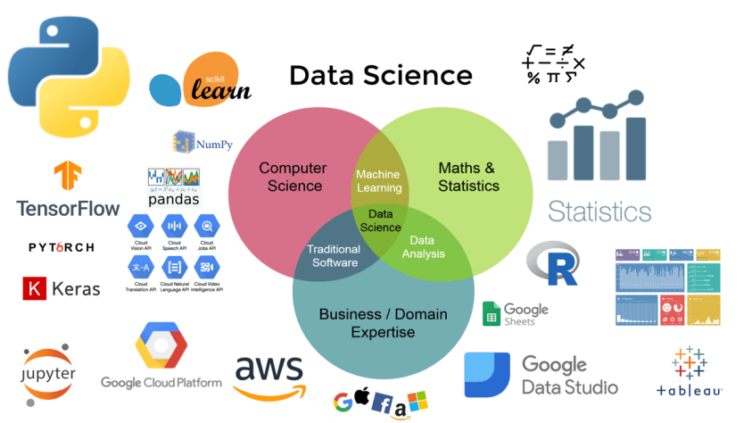

   

  

# Rodrigues
**Engenheiro de Software**

Amante do universo Geek, fã de séries sobre hackers e ficção científica e um Engenheiro de Software e de Dados que adora colocar a mão na massa desde a coleta dos dados sendo eles estruturados ou não até a construção do modelo preditivo ou descritivo. No meu dia a dia uso muito Python e SQL (esse não pode ficar nunca de fora do rolê) mas tenho um conhecimento básico de R, utilizo algumas ferramentas como Power BI, Data Studio, etc !!

**Background in:** Python | SQL | Machine Learning | DataViz.

**Links:**
* [LinkedIn](https://www.linkedin.com/in/weryck-rodrigues-b7103329b/)
* 
*

* **Modelo de clusterização para o produto de Background Check:** O objetivo é identificar se uma pessoa ou empresa apresenta risco ao negócio.
* **Sistema de recomendação para a indústria farmacêutica:** Desenvolvimento de um modelo híbrido (filtragem colaborativa e baseada em contéudo) para recomendar medicamentos e produtos de higiene e beleza em um e-commerce.
* **Análise de sentimento para o mercado financeiro:** Analisar a correlação entre as publicações nas mídias sociais e as cotações da B3.

---
"# analise-de-dados" 
"# ia-analisedados" 
